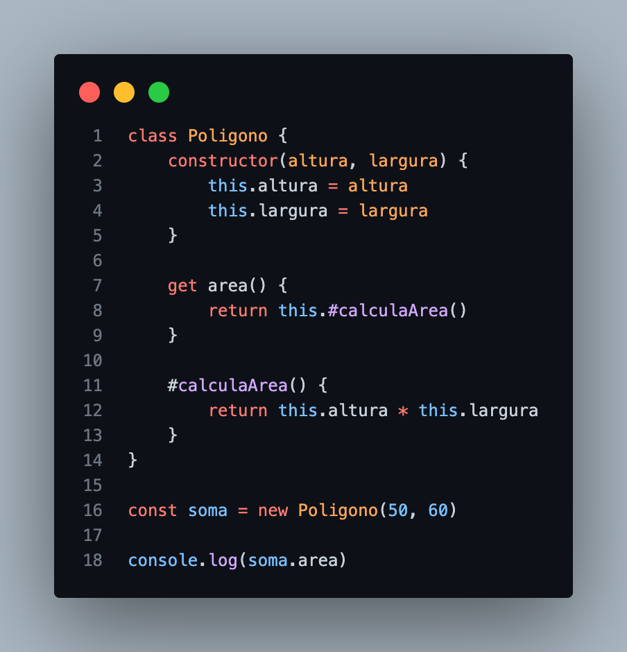
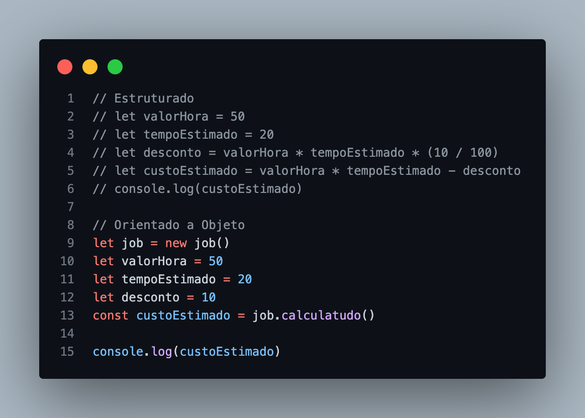

# Programação Orientada a Objeto

- Oriented Project Programming
- Um paradigma de desenvolvimento
- Uma maneira de resolver um problema, um modo de pensar
- Não está ligado apenas a linguagem de programação, mas a um entendimento amplo e atemporal para desenvolvimemto de software

================================================================

## Utilização no mercado

- [x] na maioria dos sistemas atuais
- [x] Várias linguagens (JS, TS, JAVA, PYTHON...)
- [x] Utilizado por analistas de sistemas e não só por programadores

 _na fase de levantamento de requisitos de sistemas_
 _via gráficos, desenhos e textos_

===============================

### Onde e quando eu vou utilizar?

- Linguagens de programação
- Quando quiser aplicação Padrões de Projeto
- Quando quiser organizar seu código
- Para mellhor entendimento do código, pensando nele como Objetos
- Quando precisar fazer reuso do código
- Para separar a complexidade do código, abstrair código e expor de maneira mais simples
- Para classificar a rotina e trechos do código

**Objetos**
=> Todo objeto possui

- pripriedades e funcionalidades
- estados e comportamentos
- atributos e métodos

### Classes

As classes na orientação a objetos funcionam como um molde para os objetos. Os objetos são criados a partir de uma classe e muitos deles podem ser feitos da mesma classe.

> Classes no Javascript

- Syntactical sugar
- Prototype

> Encapsulamento

- Colocar numa cápsula
- Agrupamento de funções e variáveis
- Esconder detalhes de implementação
- Camada de segurança para os atributos e métodos

### Programação Estruturada VS Orientada a Objetos

`Programação Estruturada`

- Processa a entrada e manipulação dos dados até a saída  
- Uso de sequências, estruturas de repetições e condições
- Uso de uma rotina maior ou sub-rotinas
- Não existe restrições as variáveis

`Programação Orientada a Objetos`

- Surge para trazer um cuidado ao uso estruturado
- Não elimina por completo o uso estruturado
- Conceitos como Objetos e Classes
- Cuidados com variáveis e rotinas ( Encapsulamento )
- Melhor reuso do código ( Herança )

